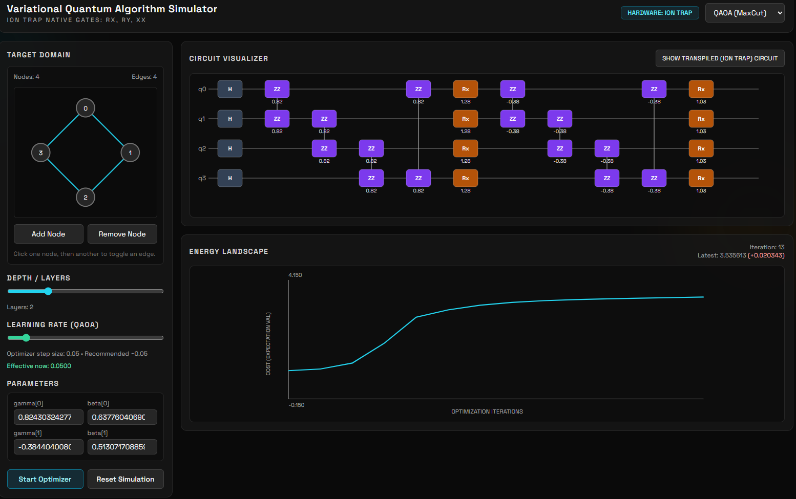

# VQA Simulator (Ion Trap Native)

Browser-based **Variational Quantum Algorithm (VQA)** simulator built with **Bun + React + TypeScript + Tailwind**.

It includes a custom state-vector simulator with only ion-trap-native gates (`Rx`, `Ry`, `XX`), plus interactive QAOA (MaxCut) and VQE workflows with live optimization, circuit visualization, and energy/cost tracking.

## Screenshot

Place your screenshot at `docs/vqa-simulator-ui.png` and it will render here:



## Features

- Custom state-vector engine initialized to `|0...0>`
- Native gate support only:
  - `applyRx(q, theta)`
  - `applyRy(q, theta)`
  - `applyXX(q1, q2, theta)` (Mølmer-Sørensen style entangler)
- Expectation calculators:
  - `expZ(q)`
  - `expZZ(q1, q2)`
  - `expXX(q1, q2)` (via basis rotation)
- Algorithms:
  - **QAOA (MaxCut)** with interactive graph builder (2-8 nodes, toggle edges)
  - **VQE (2-qubit parity-mapped chemistry)** with predefined molecules (`H2_0.74`, `H2_1.5`, `HeH`)
- Circuit views:
  - **Logical**
  - **Transpiled (Ion Trap)**
- Dynamic layer/depth controls (`1-5`) with safe parameter resizing
- Parameter-shift gradient descent optimizer (no external solver)
- Per-algorithm learning rate controls
- VQE-only learning-rate scheduling:
  - Exponential decay
  - Step decay
- VQE-only early stopping:
  - Delta threshold
  - Patience
  - Minimum iteration gate
- Energy/cost landscape chart with hover crosshair and exact values
- Responsive dark-mode UI with horizontal circuit scrolling

## Physics / Algorithm Notes

### QAOA (MaxCut)

- Logical intent:
  - Initial superposition
  - Cost layer with `ZZ(gamma)`
  - Mixer layer with `Rx(2 * beta)`
- Ion trap transpilation:
  - Initial `Ry(pi/2)`
  - Cost term: `Ry(pi/2) -> XX(gamma) -> Ry(-pi/2)`
  - Mixer remains `Rx(2 * beta)`

### VQE (Chemistry)

- 2-qubit hardware-efficient ansatz with repeated `Ry` rotations and `XX(pi/4)` entangling blocks
- Hamiltonian form:
  - `E = g0 + g1<Z0> + g2<Z1> + g3<Z0Z1> + g4<X0X1>`
- Molecules include predefined coefficients and theoretical minimum energy reference lines

## Optimizer

- Exact parameter-shift gradients
- Optimization loop runs in a timed interval in React (`~150ms`)
- Separate learning rates for QAOA and VQE
- VQE supports:
  - Decay schedule (exponential / step)
  - Early stopping based on consecutive low-delta updates

## Tech Stack

- Bun
- React 18 + TypeScript
- Vite
- Tailwind CSS
- Custom quantum simulation math (no external quantum SDK)

## Local Development

### Prerequisites

- Bun `>= 1.0`

### Install + Run

```bash
bun install
bun run dev
```

Open the app at the URL shown by Vite (typically `http://localhost:5173`).

### Build

```bash
bun run build
```

## Docker

This repo includes a multi-stage Docker build:

- Build stage: `oven/bun`
- Runtime stage: `nginx:alpine`
- SPA routing fallback configured in `docker/nginx.conf`

### Build and run

```bash
docker build -t vqa-sim .
docker run --rm -p 8080:80 vqa-sim
```

Open: `http://localhost:8080`

## Project Structure

```text
.
├── Dockerfile
├── docker/
│   └── nginx.conf
├── src/
│   ├── App.tsx
│   ├── components/
│   │   ├── CircuitVisualizer.tsx
│   │   ├── EnergyChart.tsx
│   │   ├── LearningRateSlider.tsx
│   │   ├── VqeScheduleControls.tsx
│   │   └── VqeEarlyStoppingControls.tsx
│   ├── data/
│   │   └── molecules.ts
│   └── lib/
│       ├── quantumSimulator.ts
│       ├── algorithms.ts
│       ├── circuitBuilders.ts
│       └── utils.ts
└── package.json
```

## Notes / Limits

- Simulation is state-vector based, so complexity scales exponentially with qubit count.
- QAOA graph builder is currently capped at 8 nodes in the UI.
- VQE module currently targets predefined 2-qubit parity-mapped Hamiltonians.
